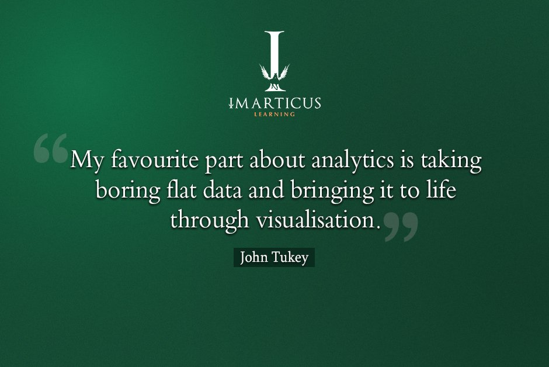
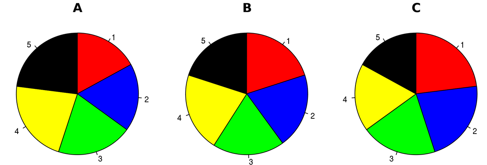
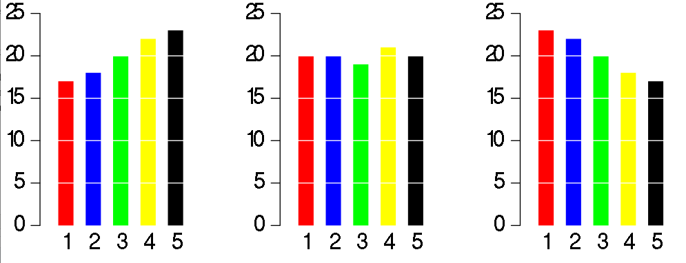
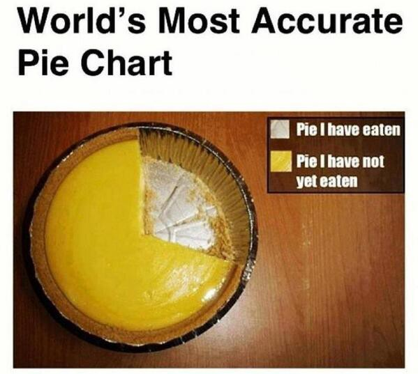

```{r knitr_init, echo = FALSE, results = "asis", cache = FALSE}
library(knitr)
library(rmdformats)

## Global options
options(max.print = "75")
opts_chunk$set(echo    = TRUE,
               cache   = FALSE,
               prompt  = FALSE,
               tidy    = FALSE,
               comment = NA,
               message = FALSE,
               warning = FALSE)
opts_knit$set(width = 75)
```

# Introduction

Data Visualization is one of the core use-cases that we can think of when we think of Data Science. 

```{r fig.show = "hold", out.width = "100%", fig.align = "default", echo = FALSE}

```

In this lunch and learn, we will turn to Twitter and see just how sorry people are and for what and bringing that to life with Data Visualization.

```{r fig.show = "hold", out.width = "100%", fig.align = "default", echo = FALSE}
knitr::include_graphics("dsLogo.png")
```

# Setup Code and Load Data

It is worth noting that here we pre-downloaded some tweets in order for this to work, please follow [this link](http://thinktostart.com/twitter-authentification-with-r/) for more information on how to set-up your twitter API.

I decided to use Twitter data, since it has a lot of very interesting features for visualization, we have :

1. Time Series (when was the tweet created)
2. Categorical (tweets from different queries, or different users)
3. Quantitative (amounts of re-tweets or favorites)
4. Text (the actual tweet)
5. Geographic (the longitude and latitude of the tweet origin)

Having all this data types in a single dataset allowed me to create some very interesting plots!

```{r}
options(scipen = 999)
library(rtweet)
library(yaml)
library(leaflet)
library(dplyr)
library(tm)
library(SnowballC)
library(wordcloud)
library(RColorBrewer)
library(dygraphs)
library(xts)
library(qdapRegex)
library(qdap)
library(tm)
library(syuzhet)

metaData <- yaml::read_yaml(file = "metadat.yaml")

# twitter_token <- rtweet::create_token(app             = metaData$twitterAPI$appName,
#                                       consumer_key    = metaData$twitterAPI$consumer_key,
#                                       consumer_secret = metaData$twitterAPI$consumer_secret)
#
# covidTweets <- rtweet::search_tweets(q = "covid", 
#                                      n = 500000, 
#                                      include_rts = TRUE, 
#                                      retryonratelimit = TRUE, 
#                                      token = twitter_token)
# 
# save(covidTweets, file = "covidTweets.RData")

load(file = "netflixTweets.RData")
load(file = "covidTweets.RData")

minDateNet <- min(netflixTweets$created_at)
minDateCov <- min(covidTweets$created_at)

maxDateNet <- max(netflixTweets$created_at)
maxDateCov <- max(covidTweets$created_at)


allTweets <- netflixTweets %>% mutate(tweetCat = "netflix") %>% 
  rbind(covidTweets %>% mutate(tweetCat = "covid")) %>% 
  filter(created_at >= max(minDateNet, minDateCov) & created_at <= min(maxDateNet, maxDateCov))

head(allTweets)
```

# Data Visualization

It is impossible to cover all possible data visualization techniques in a single session. It takes a certain amount of creativity and imagination to make data tell stories.

There is no right or wrong answer, but there are good and bad visualizations. 

## Bad Visualization

```{r fig.show = "hold", out.width = "100%", fig.align = "default", echo = FALSE}

```

Everyone ends up at some point creating pie charts. This is in fact a terrible way of representing data. Take the following as an example 

```{r fig.show = "hold", out.width = "100%", fig.align = "default", echo = FALSE}

```

Does these charts provide you with much information? The answer is NO. If we just plotted them using a bar graph :

```{r fig.show = "hold", out.width = "100%", fig.align = "default", echo = FALSE}

```

We get a lot more information from the plots, unseen to the human eye. So please please please, stop making pie charts!

```{r fig.show = "hold", out.width = "100%", fig.align = "default", echo = FALSE}

```

## Over Time

We will face time series data often, so I started with visualizing the tweets of cover vs netflix tweets over the extraction period.

```{r}
allTweets %>% 
  mutate(created_at_byhour = created_at %>% lubridate::floor_date(unit = "hour") %>% as.POSIXct(format = "%Y-%m-%dT%H:%M:%SZ", tz = "UTC")) %>%
  group_by(created_at_byhour, tweetCat) %>%
  summarise(n = n()) %>% 
  ungroup() %>%
  plotly::plot_ly(x = ~created_at_byhour, y = ~n, type = "scatter", mode = 'lines', color = ~tweetCat)
```

The same plot above can also be represented with a slider :

```{r}
tsBase <- allTweets %>% 
  mutate(created_at_byhour = created_at %>% lubridate::floor_date(unit = "hour") %>% as.POSIXct(format = "%Y-%m-%dT%H:%M:%SZ", tz = "UTC")) %>%
  group_by(created_at_byhour, tweetCat) %>%
  summarise(n = n()) %>% 
  ungroup() 

netflix_ts <- tsBase %>% filter(tweetCat == "netflix") %>% select(-tweetCat)
netflix_ts <- xts::xts(x = netflix_ts$n, order.by = netflix_ts$created_at_byhour)
covid_ts   <- tsBase %>% filter(tweetCat == "covid")   %>% select(-tweetCat)
covid_ts   <- xts::xts(x = covid_ts$n, order.by = covid_ts$created_at_byhour)
  
twitter_ts <- cbind(netflix_ts, covid_ts)

twitter_ts %>% 
  dygraph() %>%
  dySeries("covid_ts",   label = "Covid") %>%
  dySeries("netflix_ts", label = "Netflix") %>%
  dyOptions(stackedGraph = TRUE) %>%
  dyRangeSelector(height = 20)
```

If we plot the same plot as the first, but for different countries, we see that most tweets occur in the US

```{r}
allTweets %>% 
  mutate(created_at_byhour = created_at %>% lubridate::floor_date(unit = "hour") %>% as.POSIXct(format = "%Y-%m-%dT%H:%M:%SZ", tz = "UTC")) %>%
  group_by(created_at_byhour, country) %>%
  summarise(n = n()) %>% 
  group_by(country) %>% 
  mutate(countryCount = n()) %>% 
  filter(countryCount > 1, country != "", n > 20) %>% 
  ungroup() %>%
  plotly::plot_ly(x = ~created_at_byhour, y = ~n, type = "scatter", mode = 'lines', color = ~country)
```

## On A Map

Everyone likes a good map! So if you are fortunate enough to have some form of geo-graphical data in your dataset, try to get it on a map!

```{r}
# create lat/lng variables using all available tweet and profile geo-location data
map <- allTweets %>% 
  leaflet::leaflet() %>%
  leaflet::addTiles() 

groupColors <- leaflet::colorFactor(palette = c("red", "blue"), domain = allTweets$tweetCat %>% unique())

for (tc in (allTweets$tweetCat %>% unique())) {
  # d <- df3[df3$groupID == g, ]
  map <- map %>% 
    leaflet::addCircleMarkers(data = allTweets %>% filter(tweetCat == tc), 
                              lng = ~lng, 
                              lat = ~lat, 
                              color = ~groupColors(tweetCat),
                              group = tc) %>% 
    leaflet::addMarkers(clusterOptions = leaflet::markerClusterOptions(),
                        data = allTweets %>% filter(tweetCat == tc), 
                        lng = ~lng, 
                        lat = ~lat,
                        popup = allTweets %>% filter(tweetCat == tc) %>% pull(text))
  
}
map %>% leaflet::addLayersControl(overlayGroups = allTweets$tweetCat %>% unique())

```

I would like to mention that it is possible to plot based on city names, if that is all you have as well. However, having the longitude and latitude is the most useful! If you have some form of address, or city, you can get the geo-coordinates for free, using the open-source solution [openstreetmaps](https://www.openstreetmap.org/#map=6/46.449/2.210).

Do note, that having geo-coordinates ONLY, can be lead to misleading results. Since any pair of geo-coordinates are based on a particular projection, and plotting coordinates based on a particular projection on a map using another projection **WILL BE WRONG**.

```{r fig.show = "hold", out.width = "100%", fig.align = "default", echo = FALSE}

```

We can see a very good example [here](https://thetruesize.com/)

## By Groups

### Bar Graph

A classical plot is a bar graph, it is simple yet very effective.

```{r}
allTweets %>% 
  group_by(tweetCat) %>%
  summarise(totRetweets = retweet_count  %>% sum(na.rm = TRUE),
            totFavorite = favorite_count %>% sum(na.rm = TRUE)) %>%
  ungroup() %>%
  plotly::plot_ly(x = ~tweetCat,  y = ~totRetweets, type = "bar", name = "Total Retweets") %>% 
  plotly::add_bars(x = ~tweetCat, y = ~totFavorite, yaxis = "y1", name = "Total Favorites")
```

### Violin Plots

Something a bit different is a violin plot, it is an extention of a box plot, but it provides information about the entire distribution of the categorical variable : 

```{r}
allTweets %>%
  plotly::plot_ly(type = 'violin') %>%
  plotly::add_trace(x           = ~tweetCat[allTweets$tweetCat == 'netflix'],
                    y           = ~retweet_count[allTweets$tweetCat == 'netflix'],
                    scalegroup  = 'Yes',
                    name        = 'retweets - netflix',
                    side        = 'negative',
                    box         = list(visible = T),
                    meanline    = list(visible = T),
                    color       = I("blue")) %>%
  plotly::add_trace(x           = ~tweetCat[allTweets$tweetCat == 'covid'],
                    y           = ~retweet_count[allTweets$tweetCat == 'covid'],
                    scalegroup  = 'Yes',
                    name        = 'retweets - covid',
                    side        = 'positive',
                    box         = list(visible = T),
                    meanline    = list(visible = T),
                    color       = I("blue")) %>%
  plotly::add_trace(x           = ~tweetCat[allTweets$tweetCat == 'netflix'],
                    y           = ~favorite_count[allTweets$tweetCat == 'netflix'],
                    scalegroup  = 'Yes',
                    name        = 'favorites - netflix',
                    side        = 'positive',
                    box         = list(visible = T),
                    meanline    = list(visible = T),
                    color       = I("green")) %>%
  plotly::add_trace(x           = ~tweetCat[allTweets$tweetCat == 'covid'],
                    y           = ~favorite_count[allTweets$tweetCat == 'covid'],
                    scalegroup  = 'Yes',
                    name        = 'favorites - covid',
                    side        = 'negative',
                    box         = list(visible = T),
                    meanline    = list(visible = T),
                    color       = I("green")) %>%
  plotly::layout(xaxis          = list(title = ""  ),
                 yaxis          = list(title = "", zeroline = F),
                 violingap      = 0,
                 violingroupgap = 0,
                 violinmode     = 'overlay')
```

Here we have a somewhat clearer example.

```{r}
allTweets %>%
  plotly::plot_ly(type = 'violin') %>%
  plotly::add_trace(x           = ~tweetCat[allTweets$tweetCat == 'netflix'],
                    y           = ~display_text_width[allTweets$tweetCat == 'netflix'],
                    box         = list(visible = T),
                    meanline    = list(visible = T),
                    showlegend  = F) %>%
  plotly::add_trace(x           = ~tweetCat[allTweets$tweetCat == 'covid'],
                    y           = ~display_text_width[allTweets$tweetCat == 'covid'],
                    showlegend  = F) %>%
  plotly::layout(xaxis          = list(title = ""  ),
                 yaxis          = list(title = "", zeroline = F),
                 title          = "Netflix vs Covid Text Length",
                 violingap      = 0,
                 violingroupgap = 0,
                 violinmode     = 'overlay')
```

## Sankey Diagram

Sankey diagrams are great to show connections between variables. For instance. if we want to know how many tweets were from netflix that contained "covid" and how many from covid contained "netflix" we can show this clearly with a sankey diagram :

```{r}
covNet <- allTweets %>% 
  select(text, tweetCat) %>% 
  mutate(text          = text %>% tolower(),
         containsOther = ifelse(test = (tweetCat == "covid"), 
                                yes  = grepl(text, pattern = "netflix"), 
                                no   = ifelse(test = (tweetCat == "netflix"),
                                              yes  = grepl(text, pattern = "covid"),
                                              no   = FALSE))) %>% 
  group_by(tweetCat) %>% 
  summarise(n    = n(),
            both = sum(containsOther))

covNet
```

```{r}
plotly::plot_ly(
    type = "sankey",
    orientation = "h",
    node = list(
      label = c("Netflix", "Covid", "Covid", "Netflix"),
      color = c("red",     "green", "green", "red"),
      pad = 15,
      thickness = 20,
      line = list(
        color = "black",
        width = 0.5
      )
    ),

    link = list(
      source = c(0, 0, 1, 1),
      target = c(2, 3, 2, 3),
      value =  c(6, 2179, 12987, 5)
    )
  ) %>% plotly::layout(
    title = "Covid Netflix Sankey Diagram",
    font = list(
      size = 10
    )
)
```

## What The Words Show

They say a picture says a thousand words, but words can also become pictures...

We have to do a lot of cleaning to try and make the words as similar as possible. A typical step we need to take is removing stopwords, these are words that we don't need to understand a sentence. These are words such as, "as", "so", "it", etc... These words occur way to frequently so they will add noise and that is why we remove them first.

```{r}
twt_txt_cov <- allTweets %>% filter(tweetCat == "covid")   %>% pull(text) %>% qdapRegex::rm_twitter_url() %>% gsub(pattern = "[^A-Za-z]", replacement = " ") %>% tm::VectorSource() %>% tm::Corpus() 
twt_txt_net <- allTweets %>% filter(tweetCat == "netflix") %>% pull(text) %>% qdapRegex::rm_twitter_url() %>% gsub(pattern = "[^A-Za-z]", replacement = " ") %>% tm::VectorSource() %>% tm::Corpus() 

custom_stopwds_net <- c(stopwords("english"), stopwords("french"), stopwords("spanish"), "netflix", "twitter", "amp")
custom_stopwds_cov <- c(stopwords("english"), stopwords("french"), stopwords("spanish"), "covid",   "twitter", "amp")

twt_txt_cov <- twt_txt_cov %>% tm_map(tolower) %>% tm_map(removeWords, custom_stopwds_cov) %>% tm_map(stripWhitespace)
twt_txt_net <- twt_txt_net %>% tm_map(tolower) %>% tm_map(removeWords, custom_stopwds_net) %>% tm_map(stripWhitespace)

qdap::freq_terms(twt_txt_net, 60)
qdap::freq_terms(twt_txt_cov, 60)
```

Now we can create a visual word cloud between covid and netflix tweets.

```{r}
set.seed(1234)
wordcloud(twt_txt_cov, min.freq = 100, colors = brewer.pal(8, "Dark2"), 
          scale = c(3,0.5),random.order = FALSE)
```

```{r}
set.seed(1234)
wordcloud(twt_txt_net, min.freq = 30, colors = brewer.pal(8, "Dark2"), 
          scale = c(3,0.5),random.order = FALSE)
```

Words also carry sentiment, for instance a word such as "happy" is positive, indicates joy and anticipation as well as trust. If we consider all the words in all the tweets we can get a general idea of what the sentiment is for covid vs netflix tweets.

```{r}
sa_cov <- syuzhet::get_nrc_sentiment(allTweets %>% filter(tweetCat == "covid") %>% pull(text))

score_cov <- colSums(sa_cov[, ]) %>% data.frame()
names(score_cov) <- "score"
score_cov$sentiment <- rownames(score_cov)
rownames(score_cov) <- NULL

sa_net <- syuzhet::get_nrc_sentiment(allTweets %>% filter(tweetCat == "netflix") %>% pull(text))

score_net <- colSums(sa_net[, ]) %>% data.frame()
names(score_net) <- "score"
score_net$sentiment <- rownames(score_net)
rownames(score_net) <- NULL

scores_all <- score_cov %>% mutate(tweetCat = "covid") %>% 
  bind_rows(score_net %>% mutate(tweetCat = "netflix"))


scores_all %>% 
  plotly::plot_ly(x = ~sentiment,  y = ~score, type = "bar", color = ~tweetCat)
```

# Conclustion

There are a lot of data visualization we did not cover, [this link](https://www.r-graph-gallery.com/) has a lot of great example of type of graphs you can plot.

You can also find a sentiment analysis walk-through [here](https://colab.research.google.com/github/datacamp/Brand-Analysis-using-Social-Media-Data-in-R-Live-Training/blob/master/notebooks/brand_analysis_solution.ipynb#scrollTo=301nt5mj86nc).

[Hadley Wickham](http://hadley.nz/) is a world renowned data scientist and he created the grammar of graphics, which is a fundamental principle in creating great data visualization. There are a lot of great packages that applies this logic, some of them you have seen in this lunch and learn. 

Go forth and visualize! If you create/find interesting visualization, please share them!


